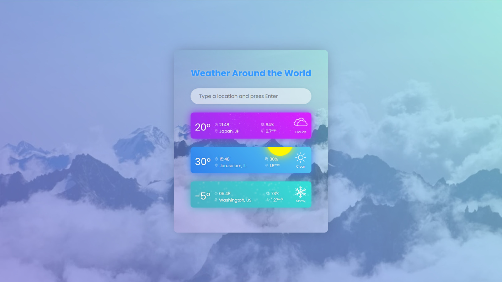

# Weather Around The World

A small React project that uses [OpenWeather's API](https://openweathermap.org/api)

Design inspired from this Dribbble shot by kenzch:

https://dribbble.com/shots/7112686-Weather-kit

## Installation:

1. Clone this git

2. add your API key to your `.env` file:

     `REACT_APP_WEATHER_API_KEY=[your api key]`.

3. `npm install && npm start`

## Available commands:

You can just use the default well-known npm commands:

### `npm start`

Runs the app in the development mode. 
Open [http://localhost:3000](http://localhost:3000) to view it in the browser.

### `npm test`

Launches the test runner in the interactive watch mode. 
See the section about [running tests](https://facebook.github.io/create-react-app/docs/running-tests) for more information.

### `npm run build`

Builds the app for production to the `build` folder. 

### `npm run eject`

Yeah... if you use it, you probably know what you are doing and the consquences of it...